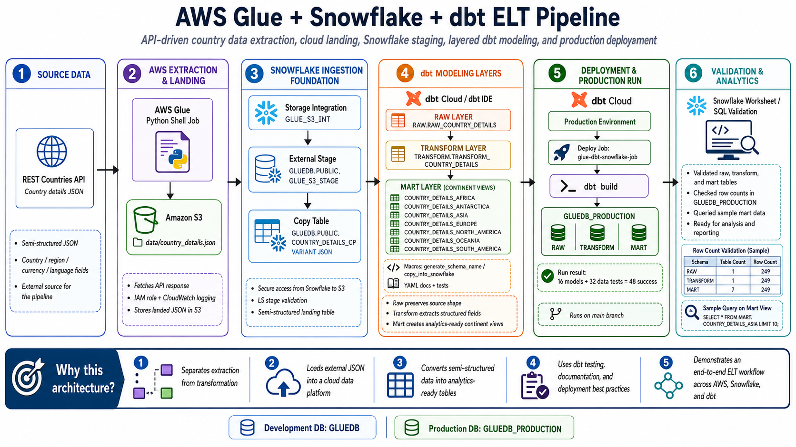

# AWS Glue + dbt + Snowflake ELT Pipeline

## Overview

This project demonstrates a guided cloud data engineering pipeline using **AWS Glue**, **Amazon S3**, **Snowflake**, and **dbt Cloud**.

The pipeline extracts country details data from an external JSON source, lands the data in S3, connects Snowflake to the S3 landing location, and uses dbt models to build raw, transform, and mart layers in Snowflake.

This project was completed as part of my data engineering studies and expanded into a portfolio-ready repo with documentation, validation screenshots, and a clean project structure.

## Architecture



### End-to-End Flow

```text
External JSON source
→ AWS Glue Python job
→ Amazon S3 landing folder
→ Snowflake storage integration and external stage
→ Snowflake copy table
→ dbt raw layer
→ dbt transform layer
→ dbt mart layer
→ dbt production job
→ GLUEDB_PRODUCTION validation
```

## What This Project Demonstrates

- Extracting JSON data from an external source with AWS Glue
- Writing source data into an S3 landing location
- Creating AWS IAM roles for Glue and Snowflake access
- Configuring a Snowflake storage integration and external stage
- Loading semi-structured JSON into Snowflake
- Building dbt models across raw, transform, and mart layers
- Using dbt macros, source configuration, YAML documentation, and tests
- Creating a dbt deployment environment and job
- Validating production Snowflake tables with row counts and sample queries

## Tech Stack

- AWS Glue
- Amazon S3
- AWS IAM
- Snowflake
- dbt Cloud
- SQL
- Python
- GitHub

## Data Source

The source data for this guided lab is a JSON file containing country details.

AWS Glue uses a Python shell job to fetch the JSON data from an external raw file URL and upload it to an S3 bucket under the `data/` prefix.

## Repository Structure

```text
.
├── architecture/
│   └── architecture-overview.md
├── dbt/
│   ├── macros/
│   │   ├── copy_into_snowflake.sql
│   │   └── generate_schema_name.sql
│   ├── models/
│   │   └── glue_snowflake/
│   │       ├── raw/
│   │       ├── transform/
│   │       └── mart/
│   ├── dbt_project.yml
│   └── README.md
├── diagrams/
│   └── aws-glue-dbt-snowflake-elt-architecture.png
├── docs/
│   ├── project-status.md
│   ├── screenshot-guide.md
│   ├── source-material-handling.md
│   └── troubleshooting.md
├── glue/
│   ├── glue_job_api_to_s3.py
│   └── README.md
├── learning-notes/
│   ├── README.md
│   ├── dbt-notes.md
│   ├── end-to-end-walkthrough.md
│   ├── how-to-explain-this-project.md
│   └── service-by-service-notes.md
├── screenshots/
│   ├── full-walkthrough/
│   ├── selected-for-readme/
│   └── README.md
├── snowflake/
│   ├── production_validation.sql
│   ├── setup_database_stage.sql
│   ├── setup_storage_integration.sql
│   └── README.md
├── .gitignore
├── LICENSE
└── README.md
```

## Pipeline Layers

### AWS Glue + S3

AWS Glue runs a Python script that extracts the source JSON file and writes it to an S3 bucket.

This creates the landing zone that Snowflake reads from later.

### Snowflake External Stage

Snowflake connects to the S3 bucket using:

- AWS IAM role
- Snowflake storage integration
- External stage
- Copy table for raw JSON data

### dbt Raw Layer

The raw layer loads and stores the semi-structured country data close to its original JSON shape.

Primary output:

```text
RAW.RAW_COUNTRY_DETAILS
```

### dbt Transform Layer

The transform layer extracts useful fields from the JSON data into structured columns, including:

- country name
- continent
- region and subregion
- capital
- population
- currency
- language
- maps and flags
- driving lane
- UN membership status

Primary output:

```text
TRANSFORM.TRANSFORM_COUNTRY_DETAILS
```

### dbt Mart Layer

The mart layer creates continent-specific reporting tables for:

- Africa
- Antarctica
- Asia
- Europe
- North America
- Oceania
- South America

Example output:

```text
MART.COUNTRY_DETAILS_AFRICA
```

### dbt Production Job

A dbt Cloud deployment job runs the project against `GLUEDB_PRODUCTION`, creating production raw, transform, and mart tables in Snowflake.

## Validation

The project was validated through:

- Successful AWS Glue job run
- JSON file created in S3
- Snowflake stage listing the S3 file
- dbt raw model build
- dbt transform model build
- dbt mart model build
- dbt production job run
- Snowflake production table row count query
- Sample query against a production mart table

## Selected Validation Screenshots

| Step | Screenshot |
|---|---|
| Glue job run succeeded | `screenshots/selected-for-readme/09-glue-job-run-success.png` |
| JSON file landed in S3 | `screenshots/selected-for-readme/10-s3-country-json-output.png` |
| Snowflake stage listed S3 file | `screenshots/selected-for-readme/20-snowflake-stage-list-country-json.png` |
| dbt raw build succeeded | `screenshots/selected-for-readme/33-dbt-build-raw-layer-success.png` |
| Snowflake raw table validated | `screenshots/selected-for-readme/34-snowflake-raw-country-details-validated.png` |
| dbt transform build succeeded | `screenshots/selected-for-readme/38-dbt-build-transform-layer-success.png` |
| Snowflake transform table validated | `screenshots/selected-for-readme/39-snowflake-transform-country-details-validated.png` |
| dbt mart build succeeded | `screenshots/selected-for-readme/46-dbt-build-mart-layer-success.png` |
| Mart table row counts validated | `screenshots/selected-for-readme/47-snowflake-mart-count-validation.png` |
| dbt production job succeeded | `screenshots/selected-for-readme/58-dbt-job-run-success.png` |
| Production tables validated | `screenshots/selected-for-readme/59-snowflake-production-table-counts.png` |
| Production mart sample data validated | `screenshots/selected-for-readme/60-snowflake-production-mart-sample-data.png` |

## Notes About Scope

This is a guided learning project and not a production deployment.

For a production implementation, improvements would include:

- Least-privilege IAM policies
- Secrets Manager or parameterized credentials
- Infrastructure as Code
- Automated testing and CI/CD
- Stronger data quality checks
- Monitoring and alerting
- Environment-specific Snowflake roles
- Key-pair or OAuth authentication for dbt/Snowflake
- More selective dbt job commands, such as running only the project-specific models

## Project Status

Completed:

- AWS Glue extraction
- S3 landing zone
- Snowflake S3 integration
- dbt raw, transform, and mart models
- dbt production job
- Snowflake validation queries
- GitHub project documentation